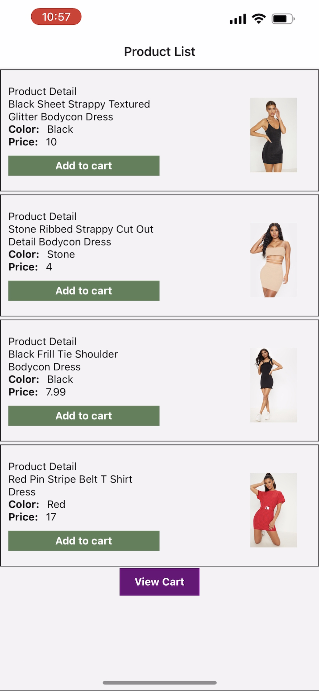

# PrettyLittleThing

A sample project to implement React thunk with Navigation.

## Installation


```bash
npm install
```

## Usage

```bash
npx expo start 
```



<video src='assets/RECORDING.MP4' width=180/>

Please make sure to update tests as appropriate.

## License
[MIT](https://choosealicense.com/licenses/mit/)